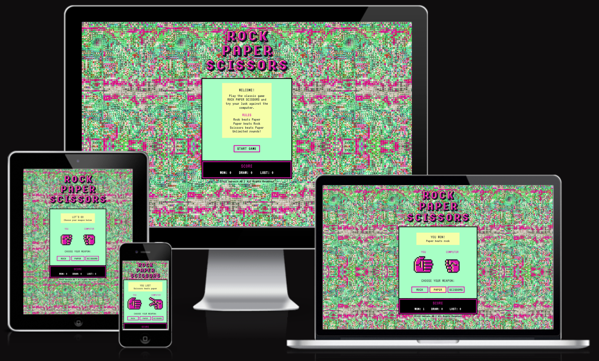
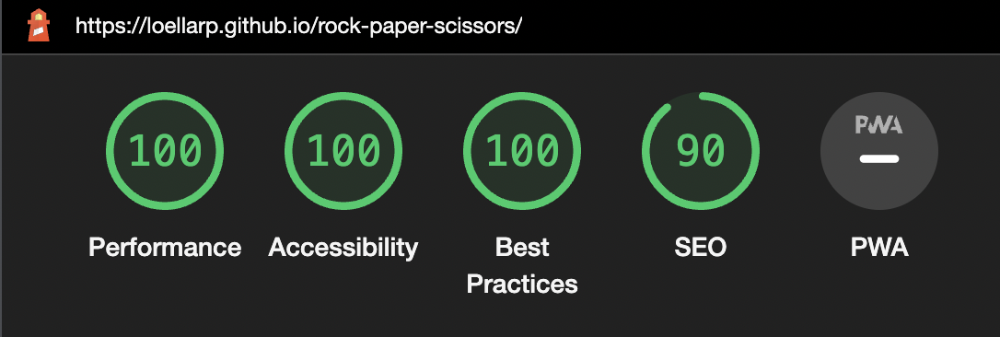
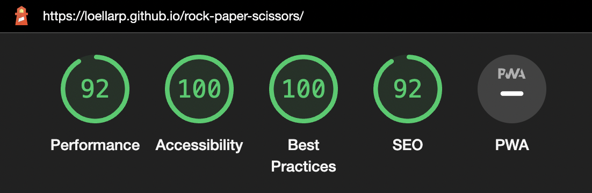

# Rock Paper Scissors - Online Game

## Javascript Essentials Portfolio Project

Summary text

## [View the website live on github pages](https://loellarp.github.io/rock-paper-scissors/)
---

# Table of contents

- [UX](#ux)
    - [Website owner business goals](#website-owner-business-goals)
    - [User goals](#user-goals)
        - [New user goals](#new-user-goals)
        - [Returning user goals](#returning-user-goals)
        - [Website owner business goals](#website-owner-business-goals)
    - [User stories](#user-stories)
    - [Structure of the website](#structure-of-the-website)
    - [Wireframes](#wireframes)
    - [Surface](#surface)
- [Features](#features)
- [Technology](#technology)
- [Testing](#testing)
    - [Functionality testing](#functionality-testing)
    - [Compatibility testing](#compatibility-testing)
    - [Code Validation](#code-validation)
    - [User stories testing](#user-stories-testing)
    - [Issues found during site development](#issues-found-during-site-development)
    - [Performance testing](#performance-testing)
- [Deployment](#deployment)
- [Credits](#credits)
- [Screenshots](#screenshots)

# UX

## Website owner business goals

Insert business goals

## User goals

- User goal 1
- User goal 2
- User goal 3

## User stories

### As a business owner:
* I ...
* I ...
* I ...

### As a user:
* I ...
* I ...
* I ...

## Structure of the website

The website is designed to...

## Wireframes

I used Balsamiq Wireframes to create the initial wireframes.

## Design

I used Sketch to create the final design of the website and created two screens within the game area.

## Surface

### Colors
The main colors used for this website:
* Background color: #653E85
* Font color: Black
* Game area background color: #A7FFC5
* Game area text box background color: #F6FFA9
* Game area border color: Black
* Score area color: Black
* Score area border color: #D814AB
* Button background color: #A7FFC5
* Button border color: #D814AB
* Button background color on click: #F6FFA9
* Footer background color: rgb(167, 255, 197, .6)

### Fonts

* The main font used on this website is VT323 with sans-serif as backup font

### Images

* The background image was provided on courtisy of Zhala Rifat Pehrsson
* The images used for the rock, paper, and scissors hands were created in [Adobe Illustrator](www.adobe.com) on the basis of pixel icons from [Adobe Stock](www.stock.adobe.com) and are credited in the [credits](#credits) section.

    
* The logo was created in [Adobe Illustrator](www.adobe.com) on the basis of a pixel typeface from [Adobe Stock](www.stock.adobe.com) and are credited in the [credits](#credits) section.

    

[Back to Table of Contents](#table-of-contents)
___
# Features

The website consists of one page with the following features:

## Header

The header contains the logo of the website.

## Game area

The game area contains two different contents depending on the stage of the game - one intro screen and one game screen:

* The intro screen (including, from top to bottom):
    * A text area:
        * This section displays a welcome message to the user explaining the game and its rules
    * A button area:
        * This section includes a button to start the game
* The game screen (including, from top to bottom):
    * A result area: 
        * This section displays the result of each round of the game including the rule behind the result.
    * A hands area: 
        * This section displays the rock, paper and scissors hands used in the game with the user's hand choice on the left and the random computer hand on the right. 
        * The default hands displayed when the user enters the game screen are two rock hands and these are later swapped to match the user's active choice and the random choice generated by the computer.
    * A controls area:
         * This section includes a CTA for the user to make a choice between rock, paper, and scissors by clicking on either of their three buttons. When DOM content has loaded and the user clicks on one of the buttons the functions of the game are called to initiate the game.

## Score area

Below the game area is the score area keeping track of the results of each round of the game. This section includes scores for won, lost, and draw that are incremented after each round depending on the result. 

## Footer

Below the score area is footer containing a short copywrite statement with the name of business owner's company.

[Back to Table of Contents](#table-of-contents)
___
# Technologies used

### HTML5
* As a markup language to structure the content of the website

### CSS
* As a styling language

### JavaScript
* As a scripting language managing all the dynamic functions of the website

### Google fonts
* As a font resource

### Balsamiq Wireframes
* As a tool to create wireframes

### Sketch
* As a tool to create the final design

### Adobe Illustrator
* As a tool to create logos and hand images

### Github
* As a software hosting platform to host the development project in a remote location

### Git
* As a distributed version control system

### Gitpod
* As a development platform

### Rapidtables.com
* As a tool to convert HEX to RGB

[Back to Table of Contents](#table-of-contents)
___
# Testing

## Functionality testing

I used Chrome developer tools throughout the development of the website to test the funtionctions of the site and solve issues with styling and responsiveness. 

## Compatibility testing

The website was.....

## User story testing

### As a business owner:

- I ...
    > ...
- I ...
    > ...
- I ...
    > ...

### As a user:

- I ...
    > ...
- I ...
    > ...
- I ...
    > ...
___
## Issues found during website deployment:

* ...
* ...
* ...

## Performance testing

I used the [Lighthouse](https://developers.google.com/web/tools/lighthouse/) tool to check the performance of the website with great results for both desktop and mobile.

### Results for desktop

### Results for mobile

## Code validation

I used three websites to validate the code at the end of the development process, with no major remarks from either of the validations:

* The [W3 Markup Validation Service](https://validator.w3.org/) to validate the HTML
* The [W3 CSS Validation Service](https://jigsaw.w3.org/css-validator/) to validate the CSS
* The [JSHint Code Quality Tool](https://jshint.com/) to validate the JavaScript

[Back to Table of Contents](#table-of-contents)
___
# Deployment

-> Insert deployment section with steps

[Back to Table of Contents](#table-of-contents)
___
# Credits

* When initiating the project I used Code Institute's student template for gitpod: [Gitpod full template](https://github.com/Code-Institute-Org/gitpod-full-template)

* Knowledge libraries:

    * [w3schools.com](https://www.w3schools.com)
    * [css-tricks.com](http://www.css-tricks.com)
    * Code Institute online course material for Diploma in Full Stack Software Development
    
### Code

* Score area html: [Love Maths](https://github.com/loellarp/love-maths)
* Hand alignment: Ideas from Ger Tobin from Code Institute's Student Care Team
* Hiding and unhiding divs with JavaScript: Ideas from Rebecca Timoney from Code Institute's Student Care Team 
* Background positioning: [Stackoverflow.com](https://stackoverflow.com/questions/17722239/full-screen-background-with-cover-but-focus-on-a-part-of-the-image)
* Double boarder css: [Youtube.com](https://www.youtube.com/watch?v=aEj1fu-aWbo)

### Images

* Pixel hands before editing: [AdobeStock_126948604.ai](https://stock.adobe.com/se/images/pixel-art-8-bit-hands-icons-and-gestures-signs-set/126948604?continue-checkout=1&asset_id=126948604)
* Retro pixel typeface: [AdobeStock_268789024.ai](https://stock.adobe.com/se/images/pixel-vector-font-design-stylized-like-in-8-bit-games/268789024?asset_id=268789024)
* Background image: By Zhala Rifat Pehrsson (not available online)

[Back to Table of Contents](#table-of-contents)
___

# Screenshots

-> Insert project screenshots 

[Back to Table of Contents](#table-of-contents)
___